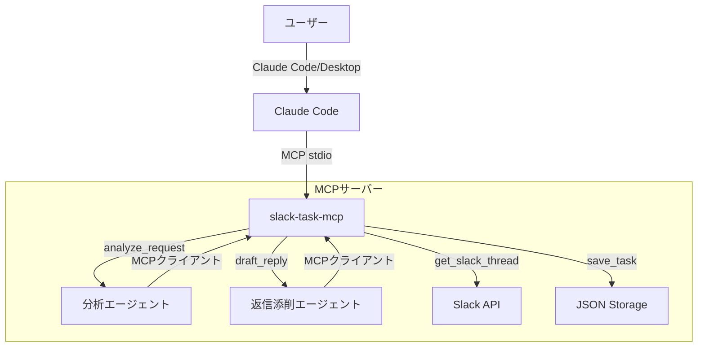

# Design Document: Agent SDK Integration

## Overview

MCPサーバーの分析・添削機能をClaude Agent SDKで実装し、システムプロンプトによる高精度な処理を実現する。MCPサーバーはSlack API操作に専念し、Agent SDKエージェントが知的処理を担当する責務分離アーキテクチャを採用する。

## Steering Document Alignment

### Technical Standards (tech.md)

- **Node.js (ES Modules)**: Agent SDKもTypeScript/ES Modulesで実装
- **Zodスキーマ**: 既存のスキーマ定義を継続利用
- **MCP準拠**: エージェントはMCPクライアントとしてSlackツールを利用

### Project Structure (structure.md)

```
packages/core/
├── src/
│   ├── index.js          # MCPサーバー（Slack操作のみ）
│   ├── auth.js            # OAuth認証
│   ├── cli.js             # CLIエントリーポイント
│   └── agents/            # 【新規】Agent SDK エージェント
│       ├── index.js       # エージェント共通設定
│       ├── analyze.js     # 分析エージェント
│       └── draft-reply.js # 返信添削エージェント
```

## Code Reuse Analysis

### Existing Components to Leverage

- **Zodスキーマ**: `AnalysisResultSchema`, `EditedReplySchema` をそのまま利用
- **フォーマット関数**: `formatAnalysisResult`, `formatEditedReply` を再利用
- **OAuth認証**: `loadCredentials()` でSlackトークンを取得

### Integration Points

- **MCPサーバー**: エージェントはMCPクライアントとしてSlackツールを呼び出す
- **credentials.json**: Slack OAuth トークンをエージェントから参照

## Architecture



### Modular Design Principles

- **責務分離**: MCPツール（IO操作）とエージェント（知的処理）を分離
- **単一責任**: 各エージェントは1つの機能に集中
- **疎結合**: エージェントはMCPプロトコル経由でSlackにアクセス

## Components and Interfaces

### Component 1: 分析エージェント (`agents/analyze.js`)

- **Purpose**: Slackスレッドの依頼を分析し、目的・不明点・確認案・優先度を生成
- **Interfaces**:
  ```javascript
  export async function analyzeRequest(threadContent, threadUrl) {
    // Agent SDK query を実行
    // 構造化された分析結果を返す
  }
  ```
- **Dependencies**: `@anthropic-ai/claude-agent-sdk`
- **System Prompt**: CLAUDE.mdの分析ルール5つを含む

### Component 2: 返信添削エージェント (`agents/draft-reply.js`)

- **Purpose**: 下書きを添削し、テンプレートに沿った構造化返信を生成
- **Interfaces**:
  ```javascript
  export async function draftReply(draftText, threadContent, taskType, tone) {
    // Agent SDK query を実行
    // 添削結果を返す
  }
  ```
- **Dependencies**: `@anthropic-ai/claude-agent-sdk`
- **System Prompt**: テンプレート（報告系/確認系/依頼系）を含む

### Component 3: エージェント共通設定 (`agents/index.js`)

- **Purpose**: エージェント共通の設定とユーティリティ
- **Interfaces**:
  ```javascript
  export const SYSTEM_PROMPTS = {
    analyze: "...",
    draftReply: "..."
  };

  export function createAgentOptions(systemPrompt) {
    return {
      allowedTools: ["Read"],
      permissionMode: "bypassPermissions",
      systemPrompt
    };
  }
  ```

## Data Models

### Agent Response (分析)

```javascript
{
  purpose: string,           // 依頼の目的
  deliverable: string | null,// 成果物
  deadline: string | null,   // 期限
  unclear_points: [{
    question: string,        // 確認すべき質問
    impact: string,          // 不明だと困る理由
    suggested_options: string[]
  }],
  confirmation_message: string | null,
  next_action: {
    action: string,
    estimated_time: number,
    reason: string
  },
  priority: "high" | "medium" | "low"
}
```

### Agent Response (返信添削)

```javascript
{
  task_type: "report" | "confirm" | "request",
  after: string,             // 添削後テキスト
  structure: {
    conclusion: string,
    reasoning: string | null,
    action: string | null
  },
  changes: [{
    type: string,
    description: string,
    reason: string
  }],
  tone: "formal" | "casual"
}
```

## Error Handling

### Error Scenarios

1. **Agent SDK接続エラー**
   - **Handling**: Claude Code認証状態を確認し、再認証を促す
   - **User Impact**: 「Claude Codeで認証してください」メッセージ表示

2. **エージェントタイムアウト**
   - **Handling**: 30秒でタイムアウト、フォールバックなし
   - **User Impact**: 「処理がタイムアウトしました。再試行してください」

3. **不正なレスポンス形式**
   - **Handling**: Zodスキーマでバリデーション、失敗時はエラー返却
   - **User Impact**: 「分析結果の解析に失敗しました」

4. **Slack認証切れ**
   - **Handling**: エージェントがMCPツール呼び出し時に検知
   - **User Impact**: 「`slack-task-mcp auth` を実行してください」

## Testing Strategy

### Unit Testing

- エージェントのシステムプロンプト検証
- Zodスキーマによるレスポンスバリデーション
- エラーハンドリングのテスト

### Integration Testing

- Agent SDK → MCPサーバー連携テスト
- 実際のSlackスレッドを使った分析テスト

### End-to-End Testing

- Claude Codeから `analyze_request` 呼び出し
- Claude Codeから `draft_reply` 呼び出し
- エラーケースのユーザー体験確認
