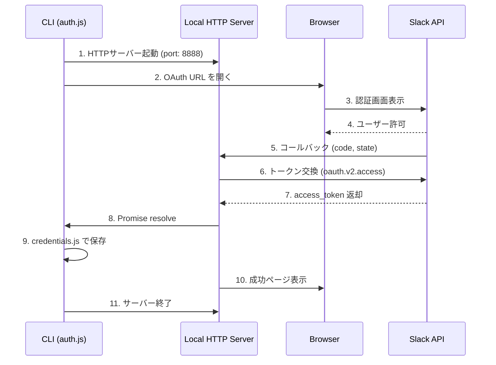

# Design Document: Local OAuth Server

## Overview

Cloudflare Workers + KV ベースの OAuth 認証を廃止し、ローカル HTTP サーバーベースの認証に移行する。同時に pnpm モノレポ構造を廃止し、シングルリポジトリ構造に変更する。

## Steering Document Alignment

### Technical Standards (tech.md)

- **Node.js (ES Modules)**: 維持
- **依存関係最小化**: 新規ライブラリ追加なし（Node.js 標準の `http` モジュール使用）
- **ローカルファイル永続化**: 既存の `credentials.js` パターンを踏襲

### Project Structure (structure.md)

モノレポ → シングルリポジトリへの移行:

```
現状:
mcp-slack-task/
├── packages/
│   ├── core/src/         # MCPサーバー
│   └── oauth-worker/src/ # Cloudflare Worker
├── pnpm-workspace.yaml
└── package.json (workspace root)

移行後:
mcp-slack-task/
├── src/                  # 全ソースコード
├── package.json          # 単一パッケージ
└── README.md
```

## Code Reuse Analysis

### Existing Components to Leverage

- **credentials.js**: 認証情報の保存・読み込み・削除（変更なしで再利用）
- **paths.js**: XDG Base Directory 準拠のパス解決（変更なしで再利用）
- **cli.js**: CLIエントリーポイント（auth コマンド部分を更新）

### Integration Points

- **Slack Web API**: トークン交換処理を Worker から auth.js に移動
- **open パッケージ**: ブラウザ起動（既存機能を維持）

## Architecture

### 新しい OAuth フロー



### Modular Design Principles

- **Single File Responsibility**:
  - `auth.js`: ローカルサーバー起動、OAuth フロー制御
  - `credentials.js`: 認証情報の永続化（既存）
  - `paths.js`: パス解決（既存）

- **Component Isolation**: OAuth ロジックを `auth.js` に集約

- **Utility Modularity**: Worker のロジック（トークン交換）を auth.js に統合

## Components and Interfaces

### Component 1: Local OAuth Server (auth.js)

- **Purpose:** ローカル HTTP サーバーを起動し、Slack OAuth コールバックを受け取る
- **Interfaces:**
  ```javascript
  // 公開API（既存インターフェース維持）
  export async function authenticate(options = {}) → Promise<boolean>
  export async function showStatus() → void
  export async function logout(options = {}) → Promise<boolean>

  // 内部関数
  function startLocalServer(port) → Promise<{server, port, url}>
  function findAvailablePort(startPort) → Promise<number>
  function exchangeCodeForToken(code, redirectUri) → Promise<TokenResponse>
  function generateState() → string
  ```
- **Dependencies:**
  - `node:http` (Node.js 標準)
  - `node:crypto` (Node.js 標準)
  - `open` (ブラウザ起動)
  - `credentials.js` (認証情報保存)
- **Reuses:** 既存の `saveCredentials()`, `listWorkspaces()`, `deleteCredentials*()`

### Component 2: Credentials Manager (credentials.js)

- **Purpose:** 認証情報の永続化管理（変更なし）
- **Interfaces:** 既存のまま維持
- **Dependencies:** `paths.js`
- **Reuses:** そのまま再利用

### Component 3: Path Resolver (paths.js)

- **Purpose:** XDG Base Directory 準拠のパス解決（変更なし）
- **Interfaces:** 既存のまま維持
- **Dependencies:** なし
- **Reuses:** そのまま再利用

## Data Models

### OAuth State (メモリ内のみ)

```javascript
// CSRF対策用の一時state（サーバー起動中のみ保持）
const pendingState = {
  state: string,      // ランダム文字列
  createdAt: number,  // 作成時刻（タイムアウト判定用）
}
```

### Token Response (Slack API)

```javascript
// oauth.v2.access レスポンス
{
  ok: boolean,
  authed_user: {
    id: string,           // user_id
    access_token: string, // xoxp-...
    scope: string,        // 許可されたスコープ
  },
  team: {
    id: string,           // team_id
    name: string,         // team_name
  }
}
```

### Credentials (既存)

```javascript
// credentials/{team_id}.json
{
  access_token: string,
  token_type: "user",
  scope: string,
  user_id: string,
  team_id: string,
  team_name: string,
  team_domain: string,
  created_at: string,  // ISO 8601
}
```

## Error Handling

### Error Scenarios

1. **ポート競合**
   - **Handling:** 8888 → 8889 → 8890... と自動で空きポートを探索
   - **User Impact:** 透過的（ユーザーは気づかない）

2. **OAuth キャンセル**
   - **Handling:** Slack から `error=access_denied` が返る
   - **User Impact:** ターミナルとブラウザ両方にキャンセルメッセージ表示

3. **トークン交換失敗**
   - **Handling:** Slack API エラーをキャッチ
   - **User Impact:** 具体的なエラーメッセージをターミナルとブラウザに表示

4. **タイムアウト（5分）**
   - **Handling:** サーバー自動終了、Promise reject
   - **User Impact:** 「認証がタイムアウトしました」メッセージ

5. **State不一致（CSRF）**
   - **Handling:** コールバックを拒否
   - **User Impact:** 「セキュリティエラー」メッセージ

## Environment Variables

### 必須

```bash
SLACK_CLIENT_ID=<Slack App Client ID>
SLACK_CLIENT_SECRET=<Slack App Client Secret>
```

### 削除される環境変数

```bash
# 不要になる
OAUTH_WORKER_URL
```

## Testing Strategy

### Unit Testing

- `findAvailablePort()`: ポート探索ロジック
- `generateState()`: state 生成
- `exchangeCodeForToken()`: モック Slack API でトークン交換

### Integration Testing

- 実際のローカルサーバー起動・終了
- コールバック URL へのリクエスト処理

### End-to-End Testing

- 手動テスト: 実際の Slack App で認証フロー確認
- CI: Slack API モックで自動テスト

## Migration Checklist

### ファイル操作

1. `packages/core/src/*` → `src/*` に移動
2. `packages/oauth-worker/` 削除
3. `packages/` ディレクトリ削除
4. `pnpm-workspace.yaml` 削除
5. ルート `package.json` を `packages/core/package.json` ベースに更新

### コード変更

1. `src/auth.js`: Worker ロジックをローカルサーバーに書き換え
2. `src/cli.js`: 変更なし（auth コマンドは auth.js を呼ぶだけ）
3. その他: パス参照の更新は不要（相対パスのため）

### ドキュメント更新

1. `README.md`: 環境変数、セットアップ手順
2. `CLAUDE.md`: 認証フローの説明
3. `.spec-workflow/steering/tech.md`: アーキテクチャ図
