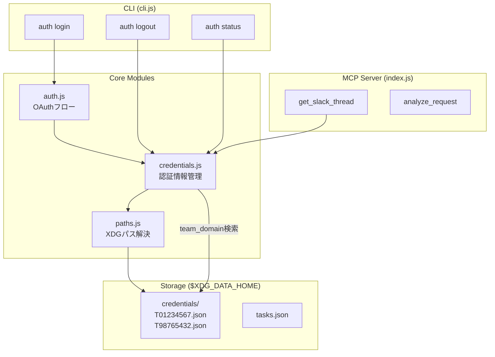

# Design Document: XDG対応 + 複数ワークスペース

## Overview

XDG Base Directory Specificationに準拠したパス管理と、複数Slackワークスペースの認証情報管理を実装する。既存の `auth.js` を分割・拡張し、モジュール性を向上させる。

## Steering Document Alignment

### Technical Standards (tech.md)

- Node.js ES Modules 維持
- Zodスキーマによるバリデーション継続
- ローカルファイルでのデータ永続化（プライバシー重視）

### Project Structure (structure.md)

```
packages/core/src/
├── index.js           # MCPサーバー（変更あり）
├── cli.js             # CLI（変更あり）
├── auth.js            # 認証フロー（リファクタ）
├── paths.js           # 【新規】XDGパス解決
├── credentials.js     # 【新規】認証情報管理
└── agents/            # 変更なし
```

## Code Reuse Analysis

### Existing Components to Leverage

- **auth.js**: OAuth フロー（`authenticate`関数）を維持、ストレージ部分を分離
- **cli.js**: コマンドパーサーを拡張
- **index.js**: `loadCredentials` を新モジュールに委譲

### Integration Points

- **Slack API呼び出し**: URL解析で `team_domain` を取得し、該当トークンを選択
- **タスク保存**: `tasks.json` の保存先を `$XDG_DATA_HOME` に移行

## Architecture



## Components and Interfaces

### paths.js（新規）

- **Purpose:** XDG Base Directory準拠のパス解決
- **Interfaces:**
  ```javascript
  getConfigDir()   // $XDG_CONFIG_HOME/slack-task-mcp
  getDataDir()     // $XDG_DATA_HOME/slack-task-mcp
  getCredentialsDir() // $XDG_DATA_HOME/slack-task-mcp/credentials
  getTasksPath()   // $XDG_DATA_HOME/slack-task-mcp/tasks.json
  ```
- **Dependencies:** `node:os`, `node:path`
- **Reuses:** なし（新規）

### credentials.js（新規）

- **Purpose:** 複数ワークスペースの認証情報CRUD
- **Interfaces:**
  ```javascript
  listWorkspaces()                    // 全ワークスペース一覧
  getCredentialsByDomain(teamDomain)  // team_domainで検索
  getCredentialsById(teamId)          // team_idで検索
  saveCredentials(credentials)        // 認証情報保存
  deleteCredentials(teamId)           // 指定ワークスペース削除
  deleteAllCredentials()              // 全削除
  ```
- **Dependencies:** `paths.js`, `node:fs/promises`
- **Reuses:** なし（新規）

### auth.js（リファクタ）

- **Purpose:** OAuth認証フローの実行
- **Interfaces:**
  ```javascript
  authenticate(options)  // OAuth実行（変更なし）
  showStatus()           // 全ワークスペース表示（拡張）
  logout(options)        // ログアウト（拡張）
  ```
- **Dependencies:** `credentials.js`, `paths.js`
- **Reuses:** 既存のOAuthポーリングロジック

### cli.js（変更）

- **Purpose:** CLIコマンドハンドリング
- **Changes:**
  - `auth` → `auth login` に変更
  - `auth logout --workspace <name>` オプション追加
- **Dependencies:** `auth.js`

### index.js（変更）

- **Purpose:** MCPサーバー
- **Changes:**
  - `loadCredentials` → `getCredentialsByDomain` に変更
  - Slack URL解析で `team_domain` 抽出
- **Dependencies:** `credentials.js`

## Data Models

### Credentials File (credentials/{team_id}.json)

```javascript
const CredentialsSchema = z.object({
  access_token: z.string(),
  token_type: z.string(),
  scope: z.string(),
  user_id: z.string(),
  team_id: z.string(),
  team_name: z.string(),
  team_domain: z.string(),  // 新規追加
  created_at: z.string(),
});
```

### Workspace Info (listWorkspaces戻り値)

```javascript
const WorkspaceInfoSchema = z.object({
  team_id: z.string(),
  team_name: z.string(),
  team_domain: z.string(),
  user_id: z.string(),
  created_at: z.string(),
});
```

## URL解析ロジック

```javascript
function extractTeamDomain(slackUrl) {
  // https://myworkspace.slack.com/archives/C123/p456
  const match = slackUrl.match(/https:\/\/([^.]+)\.slack\.com/);
  return match ? match[1] : null;
}
```

## Error Handling

### Error Scenarios

1. **未認証ワークスペースへのアクセス**
   - **Handling:** `getCredentialsByDomain` が null を返す
   - **User Impact:** 「このワークスペースは未認証です。`auth login` で認証してください。」

2. **認証情報ファイル破損**
   - **Handling:** JSONパースエラーをキャッチ、該当ファイルをスキップ
   - **User Impact:** 「認証情報が破損しています。`auth login` で再認証してください。」

3. **XDGディレクトリ作成失敗**
   - **Handling:** ディレクトリ作成時にエラーをキャッチ、適切なエラーメッセージ
   - **User Impact:** 「設定ディレクトリを作成できませんでした: {path}」

## Testing Strategy

### Unit Testing

- `paths.js`: 環境変数の有無でパスが正しく解決されるか
- `credentials.js`: CRUD操作のテスト
- URL解析: `extractTeamDomain` の各パターン

### Integration Testing

- OAuth認証 → 認証情報保存 → 読み込みの一連フロー
- 複数ワークスペース認証後の切り替え

### End-to-End Testing

- `auth login` → `auth status` → `auth logout --workspace` の一連操作
