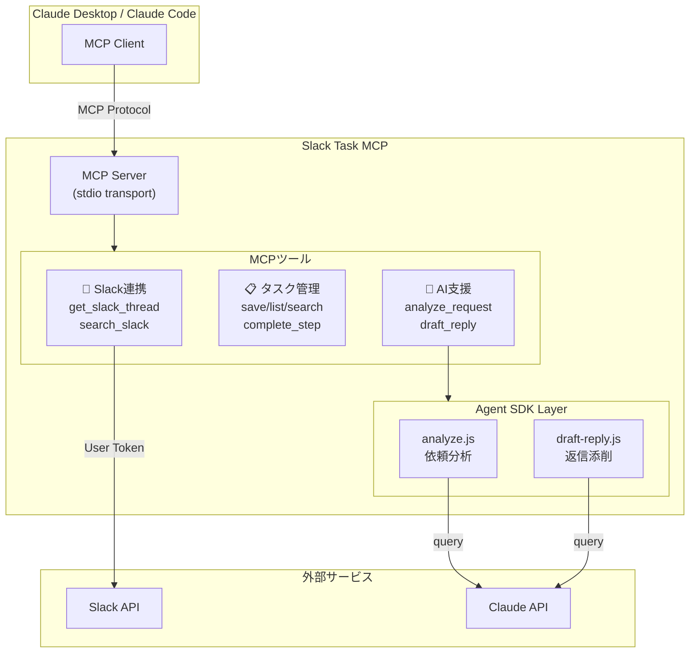

# 🧠 Slack Task MCP

**メンションから着手までの摩擦をゼロに**

[](https://www.npmjs.com/package/slack-task-mcp)
[](https://opensource.org/licenses/ISC)

---

## Why

Slackのメンションがたまると、どこから手を付けていいか迷う。難しい依頼が来ると、何を聞けばいいかわからず固まる。返信を書くのに時間がかかる——そんな経験はありませんか？

**Slack Task MCP** は、ADHDの特性を持つユーザーのために設計されたMCPサーバーです。

```
😵 メンション来た
     ↓
❓「何求められてる？」が曖昧で固まる  →  🎯 目的の明確化
     ↓
❓「何聞けばいい？」がわからない      →  📝 不明点の洗い出し + 確認メッセージ案
     ↓
❓「どう返せばいい？」で時間かかる    →  ✍️ 返信メッセージの添削・構造化
     ↓
❓「次何する？」で迷う                →  ⏭️ ネクストアクション提示
```

---

## Architecture



**ポイント:**
- **MCP Server**: Slack APIとのやり取り、タスク管理を担当
- **Agent SDK Layer**: Claude APIを使った高度な分析・添削処理を担当

---

## Features

| ツール | 機能 | Agent SDK |
|--------|------|:---------:|
| `get_slack_thread` | SlackスレッドのURLからメッセージを取得 | - |
| `analyze_request` | 依頼を分析し、目的・不明点・確認案を生成 | ✅ |
| `draft_reply` | 返信を添削し、ロジカルに構造化 | ✅ |
| `save_task` | タスクを保存（5分以内のステップに分解） | - |
| `list_tasks` | アクティブなタスク一覧を表示 | - |
| `search_tasks` | キーワード・日付でタスクを検索 | - |
| `complete_step` | ステップを完了にする | - |
| `search_slack` | Slackメッセージをキーワードで検索 | - |

---

## Quick Start

### 1. インストール

```bash
npm install -g slack-task-mcp
```

### 2. Slack認証

```bash
npx slack-task-mcp auth
```

ブラウザが開き、Slackの認証画面が表示されます。認証が完了すると、トークンは `~/.slack-task-mcp/credentials.json` に保存されます。

### 3. Claude Code / Claude Desktop の設定

**Claude Code (ターミナル)**:

```bash
claude mcp add slack-task -- npx slack-task-mcp
```

**Claude Desktop**:

`~/.claude/claude_desktop_config.json` に追加:

```json
{
  "mcpServers": {
    "slack-task": {
      "command": "npx",
      "args": ["slack-task-mcp"]
    }
  }
}
```

### 4. 再起動

設定を反映するためにClaude Code / Claude Desktopを再起動してください。

---

## Usage

### 基本ワークフロー

```
1. get_slack_thread  →  スレッド取得（文脈DB化）
2. analyze_request   →  目的・不明点・確認案を生成
3. draft_reply       →  返信の下書きを添削・構造化
4. save_task         →  タスクとして保存
5. complete_step     →  進捗管理
```

### 使用例

#### スレッドを取得・分析

```
このSlackスレッドを分析して:
https://xxx.slack.com/archives/C12345678/p1234567890123456
```

#### タスクを保存

```
このタスクを5分以内のステップに分解して保存して
```

#### 返信を添削

```
この返信を添削して「レポートできました。添付します。確認お願いします。」
```

#### タスク一覧を確認

```
タスク一覧を見せて
```

#### ステップを完了

```
ステップ1を完了にして
```

---

## ADHDフレンドリー設計

- **5分以内で終わるステップに分解** — 小さな達成感を積み重ねる
- **最初のステップは最も簡単なものに** — 着手のハードルを下げる
- **途中で止めてもOKな区切りを明示** — 中断しても再開しやすい
- **Slackを文脈DBとして活用** — 「あの話どうなったっけ」をClaudeに聞ける

---

## Tech Stack

| 技術 | 用途 |
|------|------|
| **Node.js** (ES Modules) | ランタイム |
| **MCP Protocol** | Claude Code / Desktop との通信 |
| **Claude Agent SDK** | 依頼分析・返信添削の AI 処理 |
| **Slack Web API** | Slack連携（User Token使用） |
| **Zod** | スキーマバリデーション |
| **Cloudflare Workers** | OAuth認証サーバー |

---

## Project Structure

```
slack-task-mcp/
├── packages/
│   ├── core/                    # MCPサーバー本体
│   │   └── src/
│   │       ├── index.js         # サーバーエントリポイント
│   │       ├── cli.js           # CLIコマンド
│   │       ├── auth.js          # OAuth認証
│   │       └── agents/          # Agent SDK エージェント
│   │           ├── index.js     # 共通設定
│   │           ├── analyze.js   # 依頼分析
│   │           └── draft-reply.js # 返信添削
│   └── oauth-worker/            # Cloudflare Workers (OAuth)
│       └── src/index.js
├── pnpm-workspace.yaml
└── package.json
```

---

## Data Storage

タスクデータは以下に保存されます:

```
~/.slack-task-mcp/tasks.json
~/.slack-task-mcp/credentials.json  (OAuth Token)
```

---

## Troubleshooting

### Slack APIエラー

```bash
npx slack-task-mcp auth status  # 認証状態を確認
npx slack-task-mcp auth         # 再認証
npx slack-task-mcp auth logout  # ログアウト
```

### MCPサーバーが認識されない

- 設定ファイルのパスが正しいか確認
- Claude Code / Claude Desktopを再起動したか確認

### プライベートチャンネルが読めない

- あなたが参加しているチャンネルのみ読み取り可能です

---

## Contributing

Issue や PR は歓迎です！

---

## License

[ISC](LICENSE)
